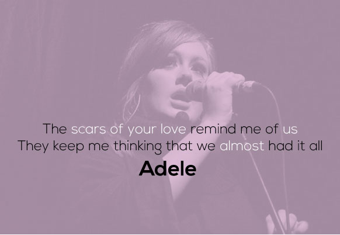

#### This report is a song lyrics analysis on word performance

#### The raw dataset: lyrics is a filtered corpus of 100,000+ song lyrics from MetroLyrics. You can find the complete 380,000+ song lyrics data on Kaggle.


```{r setup, include=FALSE}
knitr::opts_chunk$set(echo = TRUE)
```


This report may require the latest R version to view:


```{r}
print(R.version)
```


```{r, message=FALSE, warning=FALSE,echo=FALSE}
packages.used <- c('tm','tidytext','tidyverse','DT','wordcloud','topicmodels')

#chcke packages availiability
packages.needed <- setdiff(packages.used,
                    intersect(installed.packages()[,1],
                              packages.used))

#install packages
if(length(packages.needed)>0){
  install.packages(packages.needed, dependencies = TRUE)
}

#load packages
library(tm)
library(tidytext)
library(tidyverse)
library(DT)
library(wordcloud)
library(topicmodels)
```

```{r read data, warning=FALSE, echo=FALSE, message=FALSE}
#import data to be cleaned and processed
load("../data/lyrics.RData")
```

```{r text processing in tm, warning=FALSE, echo=FALSE, message=FALSE}
#preliminary cleaning of text
leadingWhitespace <- content_transformer(function(x) str_trim(x, side = "both"))
corpus <- VCorpus(VectorSource(dt_lyrics$lyrics))%>%
  tm_map(content_transformer(tolower))%>%
  tm_map(removePunctuation)%>%
  tm_map(removeWords, character(0))%>%
  tm_map(removeNumbers)%>%
  tm_map(stripWhitespace)%>%
  tm_map(leadingWhitespace)
```

```{r stopwords, warning=FALSE, echo=FALSE, message=FALSE}
data("stop_words")
#add stop words
word <- c("lot", "today", "months", "month", "wanna", "wouldnt", "wasnt", "ha", "na", "ooh", "da",
        "gonna", "im", "dont", "aint", "wont", "yeah", "la", "oi", "nigga", "fuck",
          "hey", "year", "years", "last", "past", "feel")
stop_words <- stop_words %>%
  bind_rows(mutate(tibble(word), lexicon = "custom"))
```

```{r stemming, warning=FALSE, echo=FALSE, message=FALSE}
#stemming words and converting tm object to tidy object
stemmed <- tm_map(corpus, stemDocument) %>%
  tidy() %>%
  select(text)
```


```{r tidy dictionary, warning=FALSE, echo=FALSE, message=FALSE}
#creating tidy format of the dictionary to be used for completing stems
dict <- tidy(corpus) %>%
  select(text) %>%
  unnest_tokens(dictionary, text)
```

```{r tidy stems with dictionary, warning=FALSE, echo=FALSE, message=FALSE}
#combining stems and dictionary into the same tibble
completed <- stemmed %>%
  mutate(id = row_number()) %>%
  unnest_tokens(stems, text) %>%
  bind_cols(dict) %>%
  anti_join(stop_words, by = c('dictionary' = 'word'))
```

```{r stem completion, warning=FALSE, echo=FALSE, message=FALSE}
#stem completion
completed <- completed %>%
  group_by(stems) %>%
  count(dictionary) %>%
  mutate(word = dictionary[which.max(n)]) %>%
  ungroup() %>%
  select(stems, word) %>%
  distinct() %>%
  right_join(completed) %>%
  select(-stems)
```

```{r reverse unnest, warning=FALSE, echo=FALSE, message=FALSE}
#pasting stem completed individual words into their respective lyrics
completed <- completed %>%
  group_by(id) %>%
  summarise(stemmedwords= str_c(word, collapse = " ")) %>%
  ungroup()
```

```{r cleaned dt_lyrics, warning=FALSE, echo=FALSE, message=FALSE}
#keeping a track of the processed lyrics with their own ID
dt_lyrics <- dt_lyrics %>%
  mutate(id = row_number()) %>%
  inner_join(completed)
```

```{r export data, warning=FALSE, echo=FALSE, message=FALSE}
#exporting the processed text data into a CSV file
write_csv(dt_lyrics, "../output/processed_lyrics.csv")
```


To start, I process the raw textual data 'lyrics.csv' by tokenizing, removing stopwords, and creating a tidy version of text.


```{r, message=FALSE, echo=FALSE}
#load dataset
lyrics <- read_csv('../output/processed_lyrics.csv')
```


When hear a song, the melody is always the first impression we have on it. For different genres of songs, the melodies seem to be quite distinct. While I'm curious about words variability of lyrics. Is the lyrics as changebale as melody, or on the opposite, immutable at core significant level? 

I try to answer this question in general and in timeline from the given collection of song lyrics.


```{r tokenize, warning=FALSE, echo=FALSE, message=FALSE}
#tokenize
lyrics_data <- lyrics %>%
  unnest_tokens(word, stemmedwords)
```


#### In general


```{r word frequency, warning=FALSE, echo=FALSE, message=FALSE}
lyrics_data %>%
  count(word) %>%
  arrange(desc(n)) %>%
  top_n(30,n)
```


In total without any filtering, I can see from above table that 'love', 'time', 'youre', 'baby', and 'ill' are top 5 words to be mentioned in lyrics. And I visualize the result with word cloud.


```{r visulization, warning=FALSE, echo=FALSE, message=FALSE}
#visulization
word_count_general <- lyrics_data %>%
  count(word)

wordcloud(
  words = word_count_general$word,
  freq = word_count_general$n,
  max.words = 30,
  colors = 'pink'
)
```


Then I filter dataset into different genres, and select the 4 largest genre groups to do analysis.


```{r, warning=FALSE, echo=FALSE, message=FALSE}
#find out the top 4 large group of genres
lyrics_data %>%
  count(genre) %>%
  arrange(desc(n)) %>%
  top_n(4,n)
```


The 4 largest genre groups of the dataset are Rock, Hip-Hop, Pop, Metal.


```{r, warning=FALSE, echo=FALSE, message=FALSE}
lyric_data_top <- lyrics_data %>%
  filter(genre == c('Rock', 'Hip-Hop', 'Pop', 'Metal'))
word_count_top <- lyric_data_top %>%
  count(word, genre) %>%
  group_by(genre) %>%
  top_n(20, n) %>%
  ungroup() %>%
  mutate(word2 = fct_reorder(word, n))
```


```{r, warning=FALSE, echo=FALSE, message=FALSE}
ggplot(word_count_top, aes(x = word, y = n, fill = genre))+
  geom_col(show.legend=FALSE)+
  facet_wrap(~genre, scales = 'free')+
  coord_flip()+
  labs(
    title = 'Genre Word Counts',
    x = 'Words',
    y = 'Count')
```


```{r, warning=FALSE, echo=FALSE, message=FALSE}
bag_rock <- lyrics_data %>%
  filter(genre == 'Rock')

word_count_rock <- bag_rock %>%
  count(word) %>%
  arrange(desc(n))

bag_hip <- lyrics_data %>%
  filter(genre == 'Hip-Hop')

word_count_hip <- bag_hip %>%
  count(word) %>%
  arrange(desc(n))

bag_pop <- lyrics_data %>%
  filter(genre == 'Pop')

word_count_pop <- bag_pop %>%
  count(word) %>%
  arrange(desc(n))

bag_metal <- lyrics_data %>%
  filter(genre == 'Metal')

word_count_metal <- bag_metal %>%
  count(word) %>%
  arrange(desc(n))
```


```{r, warning=FALSE, echo=FALSE, message=FALSE}
wordcloud(
  words = word_count_rock$word,
  freq = word_count_rock$n,
  max.words = 50,
  colors = 'red'
)
```


```{r, warning=FALSE, echo=FALSE, message=FALSE}
wordcloud(
  words = word_count_hip$word,
  freq = word_count_hip$n,
  max.words = 50,
  colors = 'blue'
)
```


```{r, warning=FALSE, echo=FALSE, message=FALSE}
wordcloud(
  words = word_count_pop$word,
  freq = word_count_pop$n,
  max.words = 50,
  colors = 'green'
)
```


```{r, warning=FALSE, echo=FALSE, message=FALSE}
wordcloud(
  words = word_count_metal$word,
  freq = word_count_metal$n,
  max.words = 50,
  colors = 'orange'
)
```


For Hip-Hop, 'love', 'shit', 'ya', 'yo', 'girl', 'baby', 'bitch', etc, are the most populor collection of words. Modal particles take an part that cannot be overlooked and indicate a strong emotional expression.

For Metal, 'life', 'time', 'eyes', 'die', 'live', 'love', etc, are the most populor collection of words. These words relate to a subculture to vent about society and social evils.

For Pop, 'love', 'baby', 'time', 'girl', 'heart', etc, are the most popular collection of words. Pop music is always about love story, especially heartbreak, and partying.

For Rock, 'mind', 'time', 'ill', 'day', 'life', etc, are the most popular collection of words. Themes in Rock music is sometimes related to the pressure in life.

To summarize, these four genres all have high frequencies for 'youre', which means they use the second person to sing, and this  allows writer to submerge the reader into the narrative completely. Besides, 'love' and 'life' both perform high frequencies in each subset, and this agrees with word performance in general; I conjecture that regardless of how wonderful or disappointed the love or life is, people always take care of the theme because lyrics draws similar moments and feelings everyone resonants with.


#### In timeline


```{r}
lyrics_data %>%
  count(year)
```


```{r, warning=FALSE, echo=FALSE, message=FALSE}
#filter dataset into three time stages
dt_early <- lyrics_data[lyrics_data$year < 1985, ]
dt_middle <- lyrics_data[ (lyrics_data$year < 2000) & (lyrics_data$year > 1984), ]
dt_late <- lyrics_data[lyrics_data$year >1999, ]
```


Since there are 48 years except the two earliest, I divide the dataset into three time stages. the early stage is before 1985, the middle stage is between 1985 and 2000, the late stage is after 2000.


```{r, warning=FALSE, echo=FALSE, message=FALSE}
#sentiment analysis
sentiment_early <- dt_early %>%
  inner_join(get_sentiments('nrc')) %>%
  count(genre, sentiment) %>%
  spread(sentiment, n)
sentiment_early
```


In the above table, I use 'nrc' to do a sentiment analysis. 'nrc' lexicon categorizes words in a binary fashion into categories of positive, negative, anger, anticipation, disgust, fear, joy, sadness, surprise, and trust. By looking at the counts under each columns in the table, it's easy to figure out what kind of emotions is most widely used in lyrics creation. 


```{r, warning=FALSE, echo=FALSE, message=FALSE}
position <- which.max(
  sentiment_early[sentiment_early$genre == 'Country', ]
  )
position
```


For example, Country music tend to use positive words in lyrics before year 1985.


```{r, warning=FALSE, echo=FALSE, message=FALSE}
sentiment_middle <- dt_middle %>%
  inner_join(get_sentiments('nrc')) %>%
  count(genre, sentiment) %>%
  spread(sentiment, n)
sentiment_middle
```


```{r, warning=FALSE, echo=FALSE, message=FALSE}
position <- which.max(
  sentiment_middle[sentiment_middle$genre == 'Country', ]
  )
position
```


The most frequently used words are still positive between year 1968 and 2000.


```{r, warning=FALSE, echo=FALSE, message=FALSE}
sentiment_late <- dt_late %>%
  inner_join(get_sentiments('nrc')) %>%
  count(genre, sentiment) %>%
  spread(sentiment, n)
sentiment_late
```


```{r, warning=FALSE, echo=FALSE, message=FALSE}
position <- which.max(
  sentiment_late[sentiment_late$genre == 'Country', ]
  )
position
```


Country music keeps using postive words until year 2016.

I make an assumption here that the collection of words faintly change through time based on sentiment. To verify my assumption, I initially visualize the word cloud for each stage.


```{r, warning=FALSE, echo=FALSE, message=FALSE}
count_early <- dt_early %>%
  count(word) %>%
  arrange(desc(n))

count_middle <- dt_middle %>%
  count(word) %>%
  arrange(desc(n))

count_late <- dt_late %>%
  count(word) %>%
  arrange(desc(n))
```


```{r, warning=FALSE, echo=FALSE, message=FALSE}
wordcloud(
  words = count_early$word,
  freq = count_early$n,
  max.words = 100,
  colors = 'purple'
)
```


```{r, warning=FALSE, echo=FALSE, message=FALSE}
wordcloud(
  words = count_middle$word,
  freq = count_middle$n,
  max.words = 100,
  colors = 'yellow'
)
```


```{r, warning=FALSE, echo=FALSE, message=FALSE}
wordcloud(
  words = count_late$word,
  freq = count_late$n,
  max.words = 100,
  colors = 'grey'
)
```


It seems not bad from the word cloud. However, a more scientific topics modeling is better for this situation.


```{r, warning=FALSE, echo=FALSE, message=FALSE}
#lda topics modeling for early stage

#get sparsity
dtm_early <- dt_early %>%
  count(word, genre) %>%
  cast_dtm(genre, word, n)

lda_early <- LDA(
  dtm_early,
  k = 6,
  control= list(seed = 1234)
)

#transform to tidy text
lda_early_topic <- lda_early %>%
  tidy(matrix = 'beta')

word_prob_early <- lda_early_topic %>%
  group_by(topic) %>%
  top_n(15, beta) %>%
  ungroup() %>%
  mutate(term2 = fct_reorder(term, beta))

#visualization
ggplot(
  word_prob_early,
  aes(term2, beta, fill=as.factor(topic))
) +
  geom_col(show.legend = FALSE) +
  facet_wrap(~topic, scales = 'free') +
  coord_flip()
```


```{r, warning=FALSE, echo=FALSE, message=FALSE}
#lda topics modeling for middle stage

#get sparsity
dtm_middle <- dt_middle %>%
  count(word, genre) %>%
  cast_dtm(genre, word, n)

lda_middle <- LDA(
  dtm_middle,
  k = 6,
  control= list(seed = 1234)
)

#transform to tidy text
lda_middle_topic <- lda_middle %>%
  tidy(matrix = 'beta')

word_prob_middle <- lda_middle_topic %>%
  group_by(topic) %>%
  top_n(15, beta) %>%
  ungroup() %>%
  mutate(term2 = fct_reorder(term, beta))

#visualization
ggplot(
  word_prob_middle,
  aes(term2, beta, fill=as.factor(topic))
) +
  geom_col(show.legend = FALSE) +
  facet_wrap(~topic, scales = 'free') +
  coord_flip()
```


```{r, warning=FALSE, echo=FALSE, message=FALSE}
#lda topics modeling for late stage

#get sparsity
dtm_late <- dt_late %>%
  count(word, genre) %>%
  cast_dtm(genre, word, n)

lda_late <- LDA(
  dtm_late,
  k = 6,
  control= list(seed = 1234)
)

#transform to tidy text
lda_late_topic <- lda_late %>%
  tidy(matrix = 'beta')

word_prob_late <- lda_late_topic %>%
  group_by(topic) %>%
  top_n(15, beta) %>%
  ungroup() %>%
  mutate(term2 = fct_reorder(term, beta))

#visualization
ggplot(
  word_prob_late,
  aes(term2, beta, fill=as.factor(topic))
) +
  geom_col(show.legend = FALSE) +
  facet_wrap(~topic, scales = 'free') +
  coord_flip()
```


Latent Dirichlet allocation (LDA) is a particularly popular method for fitting a topic model. It treats each document as a mixture of topics, and each topic as a mixture of words. This allows documents to “overlap” each other in terms of content, rather than being separated into discrete groups, in a way that mirrors typical use of natural language.

Looking at the topics modeling above, I find that the topics for early stage and middle stage are distributed very similar, while for late stage, the ranking of top words change, even though the collection remains the same; it seems like love story is definitely the most important topic before year 2000, compared to recent years that time topic weight more and modal particles add. 


#### Conclusion


By analyzing the song lyrics data on word performance, I come up with the following results.

+ Love and time stories are topics with the highest frequencies expected to see in lyrics, regardless of different genres.

+ Collection of words in song lyrics do not change obviously in various time stages, which indicates similar emotional expression.





#### References


https://www.liveabout.com/what-is-heavy-metal-p2-2456255

https://www.quora.com/What-are-some-common-themes-in-pop-music

https://www.tidytextmining.com/sentiment.html


